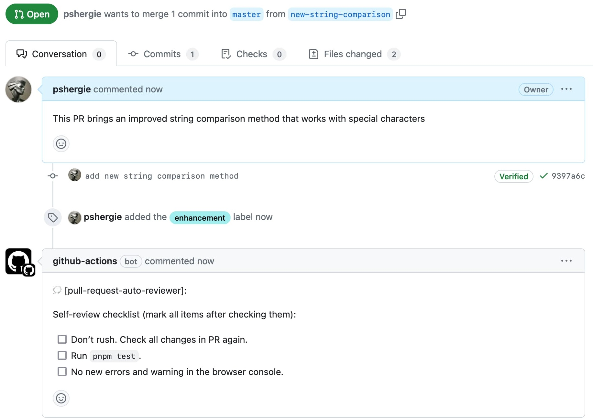

# Pull Request Auto Reviewer (GitHub Action)



__This script is for public repositories. For private ones use a [simplified version](https://github.com/pshergie/prator-private) of it.__

Add review comments to your pull requests based on changes in 3 steps:

1. Add rules for the action script [(more info)](#add-rules-for-the-action-script):

```yml
- prependMsg: "🗯️[[pull-request-auto-reviewer]](https://github.com/pshergie/prator):"
- checks:
    - paths: "**/*.js"
      message: |
        ### Please tick the following checkboxes:

        - [ ] the code is tested
        - [ ] files are compressed
        - [ ] files contain no errors
```

2. Add artifact uploading config [(more info)](#add-artifact-uploading-config):

```yml
name: Auto-review Diff Prepare
on:
  pull_request:
    branches:
      - main
      - master
jobs:
  prepare:
    name: Prepare
    runs-on: ubuntu-latest
    steps:
      - name: Checkout code
        uses: actions/checkout@v4
        with:
          fetch-depth: 2
      - name: Save PR number
        run: echo "${{ github.event.pull_request.number }}" > pr_number.txt
      - name: Generate Diff
        run: |
          git fetch origin ${{ github.event.pull_request.base.ref }}
          git diff --name-only origin/${{ github.event.pull_request.base.ref }}..${{ github.sha }} > pr_files_diff.txt
      - name: Create artifact folder
        run: mkdir -p pr_diff && mv pr_number.txt pr_files_diff.txt pr_diff/
      - name: Upload PR details as artifact
        uses: actions/upload-artifact@v4
        with:
          name: pr-diff
          path: pr_diff/
```

3. Add artifact downloading and code analysis config [(more info)](#add-artifact-downloading-and-code-analysis-config)

```yml
name: Auto Review Comment
on:
  workflow_run:
    workflows:
      - Auto-review Diff Prepare
    types:
      - completed
permissions:
  pull-requests: write
jobs:
  auto-review:
    name: Review
    runs-on: ubuntu-latest
    steps:
      - name: Checkout the repository
        uses: actions/checkout@v4
      - name: Download PR diff from auto review prepare step
        uses: actions/download-artifact@v4
        with:
          name: pr-diff
          path: pr_diff/
          repository: ${{ github.repository_owner }}/${{ github.event.repository.name }}
          run-id: ${{ github.event.workflow_run.id }}
          github-token: ${{ secrets.GITHUB_TOKEN }}
      - name: Analyze changes
        uses: pshergie/prator@v1
        id: auto-review-action
        with:
          token: ${{ secrets.GITHUB_TOKEN }}
          rules-path: path-to-your-rules-file
```

## Add rules for the action script

For this step you need to create a YAML file with the rules that are going to be utilized by the action script. There you need to specify 2 params:

- `prependMsg` is a message that is prepended to every message of GitHub actions bot. Leave empty if not needed.
- `checks` contains a list of `paths` and `message` keys. `paths` is dedicated to specify path(s) of changes that would trigger posting of a followed `message` as a pull request comment. In case of multiple `paths` they should be separated by a comma. `message` could be a simple string or markdown. All messages will be combined into a single comment.

## Add artifact uploading config

Since posting comments on GitHub requires write permission you need two create 2 workflows. One to collect PR changes and upload as artifact (this  step) and another to download them and apply the script (next step). There's an optional `artifact-path` parameter if you want a different path to the artifact (make sure that this change is reflected in the download artifact config). The default value is `pr_diff/`

## Add artifact downloading and code analysis config

In this step create a workflow that downloads the artifact and applies the script. `pull-requests: write` permission is needed for the GitHub actions bot to be able to post a comment in a PR. It's also important to provide 2 params that are being consumed by the action script:

- `token`: your GitHub token
- `rules-path`: a path to the file with rules that you have specified earlier (for instance `.github/auto-review-rules.yml`)

__Note:__ The workflow executes from the main/master branch and is not visible in the PR checks.
